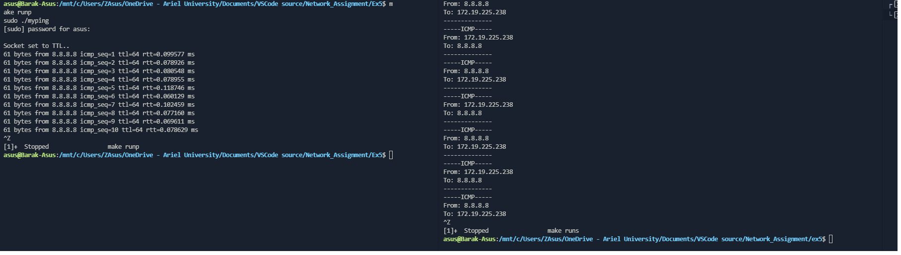

# ICMP Sniffer and Pinger

## How to run the app on Ubuntu
```bash
# Clone the repository
$ git clone https://github.com/bsharabi/Network_Assignment.git
# Go into the repository
$ cd Network_Assignment/Ex5
# Open the terminal 
$ Run "make all"
```

## How to run the Sniffer on Ubuntu
```bash
# Open another one terminal
$ Run "make runs"
```

## How to run the Pinger on Ubuntu
```bash
# Open another one terminal 
$ Run "make runp"
```
### Example
